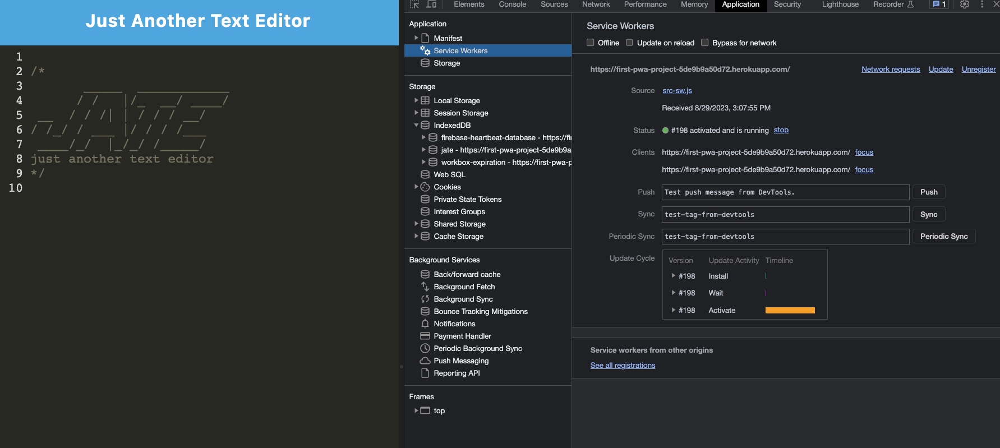

# PWA Text Editor

Link to the deployed app on Heroku : https://first-pwa-project-5de9b9a50d72.herokuapp.com/

## Description
For this project, I converted an application into a PWA (Progressive Web Application). In order to achieve this, I used  I installed service workers with a cache first strategy to cache all the assets--.js , .css , .html files--when first connected to the internet. On top of this, I utilized indexedDB, with CRUD operations, in order to temporarily store information when used offline. Due to my work, I also was able to get this application to a passing Light House score in order to be considered a PWA! 

## Installation
In order to install, you need to clone this repo to you pc. Once installed, cd into the app and run `npm install`, then run `npm start`.

## Usage
Go to deployed link and click `install` if you want to use this offline

## License
This application is covered under the MIT license.

## Questions
For questions about the project, you can reach me via:
- GitHub: [Lopez-Jordan](https://github.com/Lopez-Jordan)
- Email: jordanlopezemail@gmail.com
    